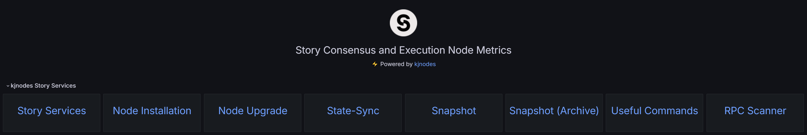
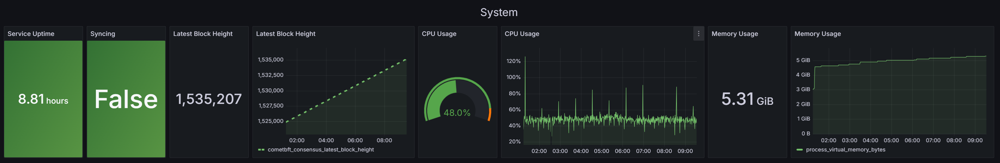
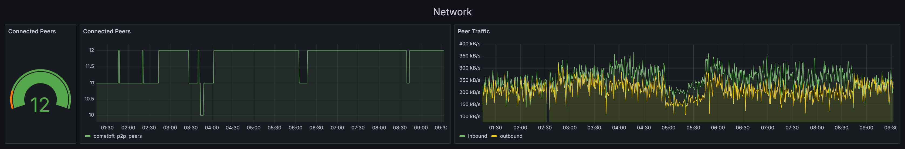
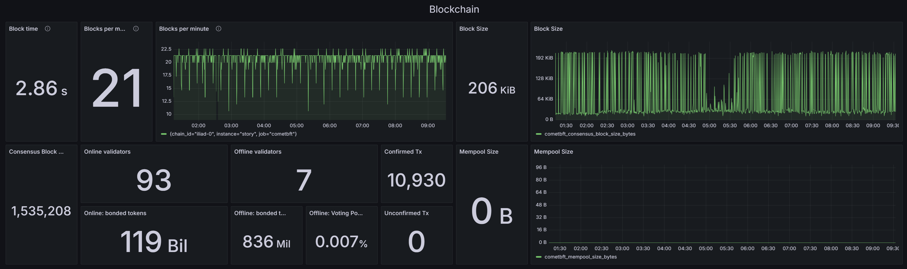
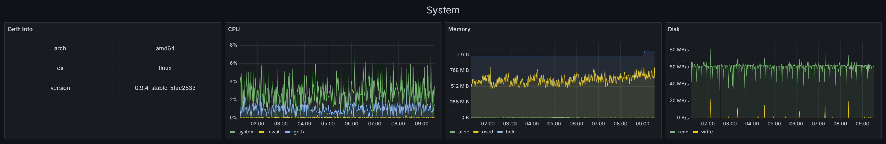
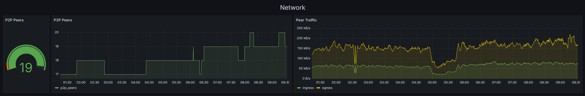
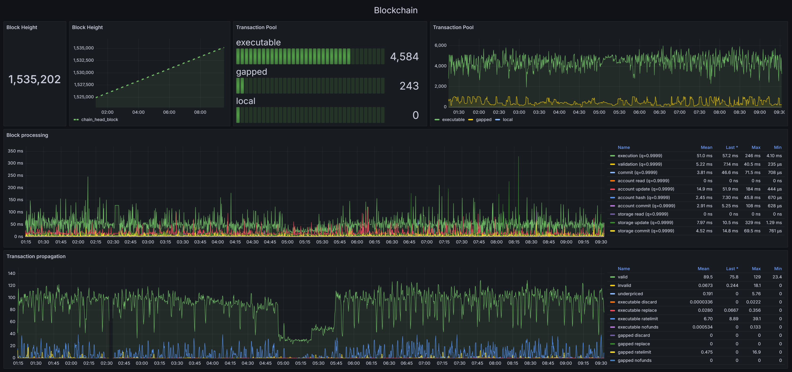
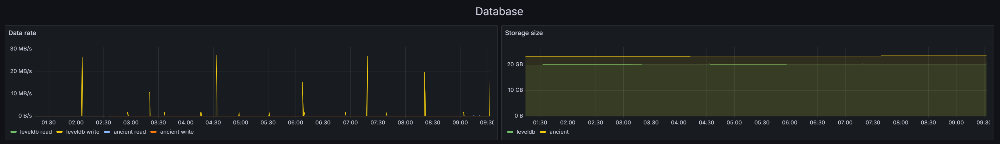
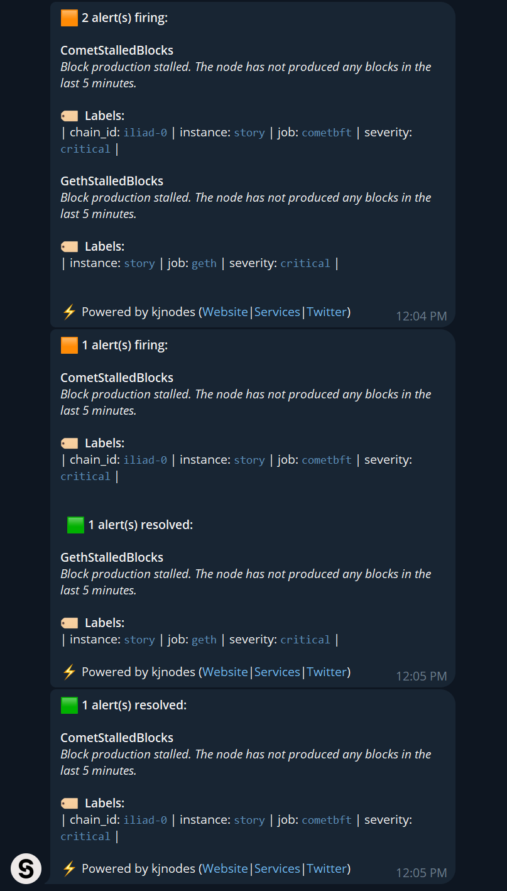

# Story Node Monitoring stack

This project provides a monitoring solution for Story Node services using Prometheus, Grafana, and Alertmanager. The stack enables real-time data visualization, monitoring, and alerting for your node's health and performance.

## Installation

Follow these steps to install the necessary dependencies and deploy the monitoring stack.

### 1. Install Docker

Install Docker, a containerization platform required for running the monitoring services:

```bash
sudo apt-get update
sudo apt-get -y install ca-certificates curl

sudo install -m 0755 -d /etc/apt/keyrings
sudo curl -fsSL https://download.docker.com/linux/ubuntu/gpg -o /etc/apt/keyrings/docker.asc
sudo chmod a+r /etc/apt/keyrings/docker.asc

echo "deb [arch=$(dpkg --print-architecture) signed-by=/etc/apt/keyrings/docker.asc] https://download.docker.com/linux/ubuntu $(. /etc/os-release && echo "$VERSION_CODENAME") stable" | sudo tee /etc/apt/sources.list.d/docker.list > /dev/null
sudo apt-get update

sudo apt-get -y install docker-ce docker-ce-cli containerd.io docker-buildx-plugin docker-compose-plugin

sudo systemctl enable docker.service containerd.service
sudo systemctl start docker.service containerd.service
```

### 2. Clone the Monitoring Stack Repository

Clone the repository that contains the monitoring stack configuration:

```bash
rm -rf $HOME/story-node-monitoring
git clone https://github.com/kjnodes/story-node-monitoring.git $HOME/story-node-monitoring
```

## Pre-Configuration

Before deploying the monitoring stack, configure Alerting and Prometheus settings.

### 1. Set Up Telegram Alerting

Configure Alertmanager to send notifications via Telegram. Update the `YOUR_TELEGRAM_BOT_TOKEN` and `YOUR_TELEGRAM_USER_ID` in the Alertmanager configuration file.

| KEY | VALUE |
|---------------|-------------|
| YOUR_TELEGRAM_USER_ID | Your Telegram user ID can be obtained from [@userinfobot](https://t.me/userinfobot). |
| YOUR_TELEGRAM_BOT_TOKEN | Get your bot token from [@botfather](https://telegram.me/botfather). Follow the steps outlined [here](https://core.telegram.org/bots#6-botfather) to create a new token. |

Edit the configuration file:

```bash
vim $HOME/story-node-monitoring/prometheus/alert_manager/alertmanager.yml
```

Example configuration:

```yml
global:
  resolve_timeout: 1m

templates: 
- 'templates/*.tmpl'

route:
  receiver: 'telegram'
  group_by: []            # Empty list to avoid grouping alerts
  group_wait: 0s          # Send notifications immediately
  group_interval: 1s      # Set a minimal interval for ongoing alerts
  repeat_interval: 4h     # Repeat notifications for ongoing alerts every 4 hours

receivers:
  - name: 'telegram'
    telegram_configs:
      - send_resolved: true
        bot_token: '74064354354:AfeDFge7zdw-oJBOyf1CuEryo9gwpFfcw'
        chat_id: 442175262
        message: '{{ template "telegram.message" . }}'
```

### 2. Configure Prometheus

Set up Prometheus by specifying the `IP` address and `ports` for your node services. Modify the `YOUR_NODE_IP:COMET_PORT` and `YOUR_NODE_IP:GETH_PORT` in the configuration file:

```bash
vim $HOME/story-node-monitoring/prometheus/prometheus.yml
```

Example configuration:

```yml
global:
  scrape_interval: 15s
  scrape_timeout: 10s
  evaluation_interval: 15s
alerting:
  alertmanagers:
    - follow_redirects: true
      scheme: http
      timeout: 10s
      api_version: v2
      static_configs:
        - targets:
            - alertmanager:9093
rule_files:
  - /etc/prometheus/alerts/alert.rules
scrape_configs:
  - job_name: prometheus
    metrics_path: /metrics
    static_configs:
      - targets:
          - localhost:9090
  - job_name: cometbft
    metrics_path: /metrics
    static_configs:
      - targets:
          - 192.168.0.1:26660
        labels:
          instance: story
  - job_name: geth
    metrics_path: /debug/metrics/prometheus
    static_configs:
      - targets:
          - 192.168.0.1:6060
        labels:
          instance: story
```

## Monitoring stack deployment

```bash
cd $HOME/story-node-monitoring
docker compose up -d
```

## Data Visualization Using Grafana

Follow these steps to access and use the Story Node Dashboard in Grafana:

1. Open Grafana in your web browser (default port: 9999).

2. Log in using the default credentials `admin/admin`, then set a new password.

3. Navigate to the `Dashboards` page to access the `Story Node Dashboard`.

## Dashboard contents

The Grafana dashboard is organized into three main sections:

### 1. kjnodes Story Services**

Contains links to kjnodes provided services for Story Protocol.



### 2. Cometbft Node Metrics

Displays key metrics for monitoring the health, performance, and activity of the CometBFT node.

#### 2.1. System

Shows system related metrics like node status, service uptime, memory and cpu usage.



#### 2.2. Network

Network metrics like node peer connections and traffic.



#### 2.3. Blockchain

Displays blockchain metrics like block time, blck size and information active validator set.



### 3. Geth Node Metrics

Shows metrics related to the health, resource consumption, and activity of the Geth node.

#### 3.1. System

Shows system related metrics like geth binary version and system resource consumption.



#### 3.2. Network

Network metrics like node peer connections and traffic.



#### 3.3. Blockchain

Displays blockchain metrics like block and transaction processing.



#### 3.4. Database

Displays database metrics like block time, blck size and information active validator set.



## Alerting and Notifications

Alertmanager triggers alerts and sends notifications when configured conditions are met, such as degraded block synchronization or low peers.

<div style="text-align: center;">
    
</div>

## Clean Up All Container Data

To stop and remove the monitoring stack and associated data, execute:

```
cd $HOME/story-node-monitoring
docker compose down --volumes
```

## Accessing the Monitoring Stack UI

You can access the monitoring tools using these ports:
- Prometheus: 9090
- Alertmanager: 9093
- Grafana: 9999
