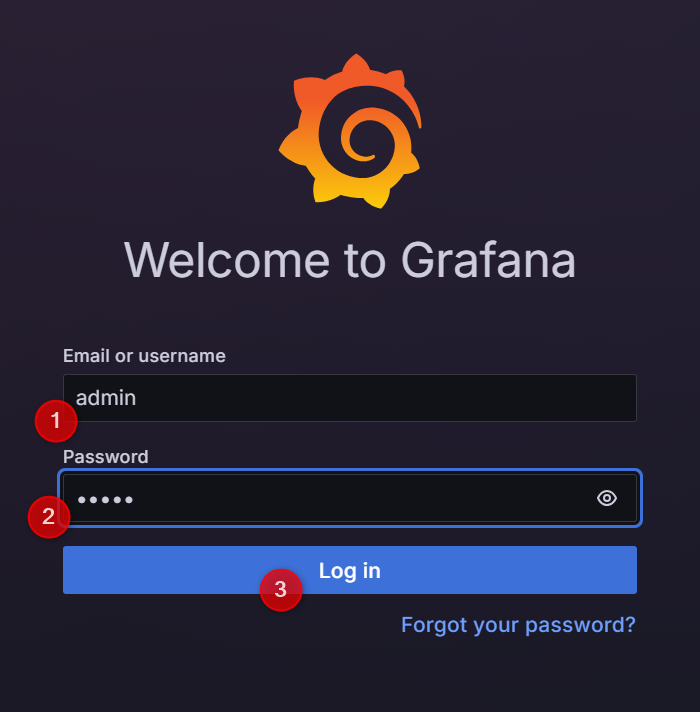
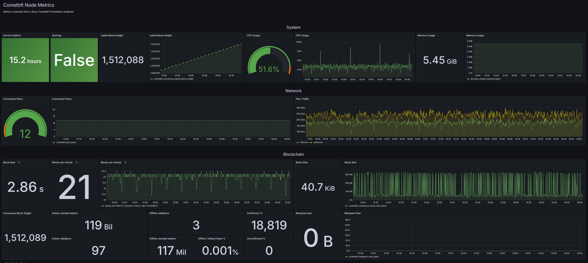

# Story Node Monitoring stack

This project provides a monitoring solution for Story Node services using Prometheus, Grafana, and Alertmanager. The stack enables real-time data visualization, monitoring, and alerting for your node's health and performance.

## Installation

Follow these steps to install the necessary dependencies and deploy the monitoring stack.

### 1. Install Updates and Dependencies

Update your system and install essential tools:

```bash
sudo apt-get update
sudo apt install jq -y
```

### 2. Install Docker

Install Docker, a containerization platform required for running the monitoring services:

```bash
sudo apt-get install ca-certificates curl gnupg lsb-release wget -y
curl -fsSL https://download.docker.com/linux/ubuntu/gpg | sudo gpg --dearmor -o /usr/share/keyrings/docker-archive-keyring.gpg
sudo chmod a+r /usr/share/keyrings/docker-archive-keyring.gpg
echo "deb [arch=$(dpkg --print-architecture) signed-by=/usr/share/keyrings/docker-archive-keyring.gpg] https://download.docker.com/linux/ubuntu $(lsb_release -cs) stable" | sudo tee /etc/apt/sources.list.d/docker.list > /dev/null
sudo apt-get update
sudo apt-get install docker-ce docker-ce-cli containerd.io -y
```

### 3. Install Docker Compose

Docker Compose is required to manage multi-container Docker applications:

```bash
docker_compose_version=$(wget -qO- https://api.github.com/repos/docker/compose/releases/latest | jq -r ".tag_name")
sudo wget -O /usr/bin/docker-compose "https://github.com/docker/compose/releases/download/${docker_compose_version}/docker-compose-`uname -s`-`uname -m`"
sudo chmod +x /usr/bin/docker-compose
```

### 4. Clone the Monitoring Stack Repository

Clone the repository that contains the monitoring stack configuration:

```bash
cd $HOME && rm -rf story-node-monitoring
git clone https://github.com/kjnodes/story-node-monitoring.git
```

## Pre-Configuration

Before deploying the monitoring stack, configure Alerting and Prometheus settings.

### 1. Set Up Telegram Alerting

Configure Alertmanager to send notifications via Telegram. Update the `YOUR_TELEGRAM_BOT_TOKEN` and `YOUR_TELEGRAM_USER_ID` in the Alertmanager configuration file.

| KEY | VALUE |
|---------------|-------------|
| YOUR_TELEGRAM_USER_ID | Your Telegram user ID can be obtained from [@userinfobot](https://t.me/userinfobot). The bot will only respond to messages sent from the specified user. |
| YOUR_TELEGRAM_BOT_TOKEN | Get your bot token from [@botfather](https://telegram.me/botfather). Follow the steps outlined [here](https://core.telegram.org/bots#6-botfather) to create a new token. |

Edit the configuration file:

```bash
vim $HOME/story-node-monitoring/prometheus/alert_manager/alertmanager.yml
```

Example configuration:

```yml
global:
  resolve_timeout: 1m

templates: 
- 'templates/*'

route:
  receiver: 'telegram'
  group_wait: 30s
  group_interval: 5m
  repeat_interval: 12h

receivers:
  - name: 'telegram'
    telegram_configs:
      - send_resolved: true
        bot_token: '74064354354:AfeDFge7zdw-oJBOyf1CuEryo9gwpFfcw'
        chat_id: 442175262
```

### 2. Configure Prometheus

Set up Prometheus by specifying the `IP` address and `ports` for your node services. Modify the `YOUR_NODE_IP:COMET_PORT` and `YOUR_NODE_IP:GETH_PORT` in the configuration file:

```bash
vim $HOME/story-node-monitoring/prometheus/prometheus.yml
```

Example configuration:

```yml
global:
  scrape_interval: 15s
  scrape_timeout: 10s
  evaluation_interval: 15s
alerting:
  alertmanagers:
    - follow_redirects: true
      scheme: http
      timeout: 10s
      api_version: v2
      static_configs:
        - targets:
            - alertmanager:9093
rule_files:
  - /etc/prometheus/alerts/alert.rules
scrape_configs:
  - job_name: prometheus
    metrics_path: /metrics
    static_configs:
      - targets:
          - localhost:9090
  - job_name: cometbft
    metrics_path: /metrics
    static_configs:
      - targets:
          - 192.168.0.1:26660
        labels:
          instance: story
  - job_name: geth
    metrics_path: /debug/metrics/prometheus
    static_configs:
      - targets:
          - 192.168.0.1:6060
        labels:
          instance: story
```

## Monitoring stack deployment

```bash
cd $HOME/story-node-monitoring && docker-compose up -d
```

## Data Visualization Using Grafana

Follow these steps to access and use the Story Node Dashboard in Grafana:

1. Open Grafana in your web browser (default port: 9999).



2. Log in using the default credentials `admin/admin`, then set a new password.

3. Navigate to the `Dashboards` page to access the `Story Node Dashboard`.

## Dashboard contents

The Grafana dashboard is organized into three main sections:

- **kjnodes Story Services** - contains links to kjnodes provided services for Story Protocol.


- **Cometbft Node Metrics** - displays key metrics for monitoring the health, performance, and activity of the CometBFT node.



- **Geth Node Metrics** - shows metrics related to the health, performance, and activity of the Geth node.


## Alerting and Notifications

Alertmanager triggers alerts and sends notifications when configured conditions are met, such as degraded block synchronization or low peers.


## Clean Up All Container Data

To stop and remove the monitoring stack and associated data, execute:

```
cd $HOME/story-node-monitoring
docker-compose down
docker volume prune -f
```

## Accessing the Monitoring Stack UI

You can access the monitoring tools using these ports:
- Prometheus: 9090
- Alertmanager: 9093
- Grafana: 9999
