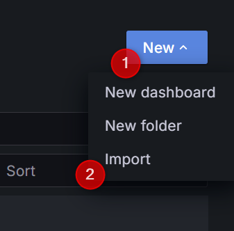
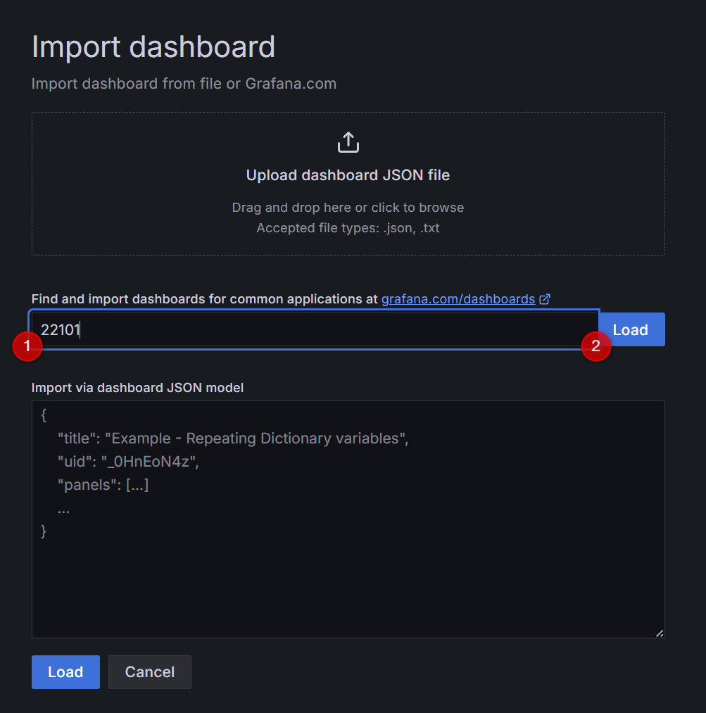
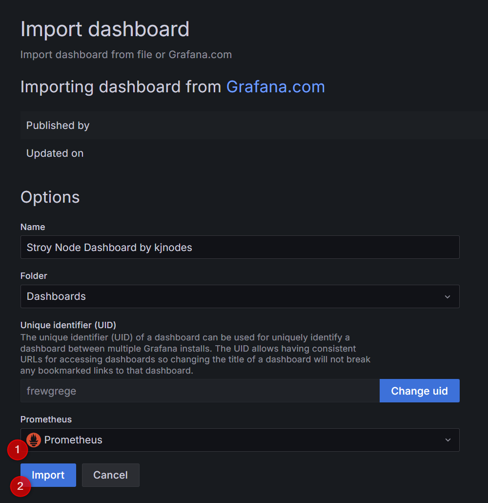

# Install updates and dependencies
```bash
sudo apt-get update
sudo apt install jq -y
```

# Install docker
```bash
sudo apt-get install ca-certificates curl gnupg lsb-release wget -y
curl -fsSL https://download.docker.com/linux/ubuntu/gpg | sudo gpg --dearmor -o /usr/share/keyrings/docker-archive-keyring.gpg
sudo chmod a+r /usr/share/keyrings/docker-archive-keyring.gpg
echo "deb [arch=$(dpkg --print-architecture) signed-by=/usr/share/keyrings/docker-archive-keyring.gpg] https://download.docker.com/linux/ubuntu $(lsb_release -cs) stable" | sudo tee /etc/apt/sources.list.d/docker.list > /dev/null
sudo apt-get update
sudo apt-get install docker-ce docker-ce-cli containerd.io -y
```

# Install docker compose
```bash
docker_compose_version=$(wget -qO- https://api.github.com/repos/docker/compose/releases/latest | jq -r ".tag_name")
sudo wget -O /usr/bin/docker-compose "https://github.com/docker/compose/releases/download/${docker_compose_version}/docker-compose-`uname -s`-`uname -m`"
sudo chmod +x /usr/bin/docker-compose
```

# Clone repository
```bash
cd $HOME && rm -rf story-node-monitoring
git clone https://github.com/kjnodes/story-node-monitoring.git
```

# Copy _.env.example_ into _.env_
```bash
cp $HOME/story-node-monitoring/config/.env.example $HOME/story-node-monitoring/config/.env
```

# Update values in _.env_ file
```bash
vim $HOME/story-node-monitoring/config/.env
```

| KEY | VALUE |
|---------------|-------------|
| TELEGRAM_ADMIN | Your user id you can get from [@userinfobot](https://t.me/userinfobot). The bot will only reply to messages sent from the user. All other messages are dropped and logged on the bot's console |
| TELEGRAM_TOKEN | Your telegram bot access token you can get from [@botfather](https://telegram.me/botfather). To generate new token just follow a few simple steps described [here](https://core.telegram.org/bots#6-botfather) |

# Export _.env_ file values into _.bash_profile_
```bash
echo "export $(xargs < $HOME/story-node-monitoring/config/.env)" > $HOME/.bash_profile
source $HOME/.bash_profile
```

# Adjust YOUR_NODE_IP:PORT to match sotry node metrics endpoints in prometheus config file
```bash
vim $HOME/story-node-monitoring/prometheus/prometheus.yml
```

Example
```yml
global:
  scrape_interval: 15s
  scrape_timeout: 10s
  evaluation_interval: 15s
alerting:
  alertmanagers:
    - follow_redirects: true
      scheme: http
      timeout: 10s
      api_version: v2
      static_configs:
        - targets:
            - alertmanager:9093
rule_files:
  - /etc/prometheus/alerts/alert.rules
scrape_configs:
  - job_name: prometheus
    metrics_path: /metrics
    static_configs:
      - targets:
          - localhost:9090
  - job_name: cometbft
    metrics_path: /metrics
    static_configs:
      - targets:
          - 192.168.0.1:26660
        labels:
          instance: story
  - job_name: geth
    metrics_path: /debug/metrics/prometheus
    static_configs:
      - targets:
          - 192.168.0.1:6060
        labels:
          instance: story
```

# Run docker-compose
Deploy the monitoring stack
```bash
cd $HOME/story-node-monitoring && docker-compose up -d
```

ports used:
- `9090` (prometheus)
- `9093` (alertmanager)
- `9999` (grafana)

## Configuration

### Configure Grafana
1. Open Grafana in your web browser. It should be available on port `9999`


2. Login using defaults `admin/admin` and change password

3. Import custom dashboard

3.1. Press "+" icon on the left panel and then choose **"Import"**



3.2. Input grafana.com dashboard id `22101` and press **"Load"**



3.3. Select Prometheus data source and press **"Import"**



4. Congratulations you have successfully imported Story Node Dashboard!
